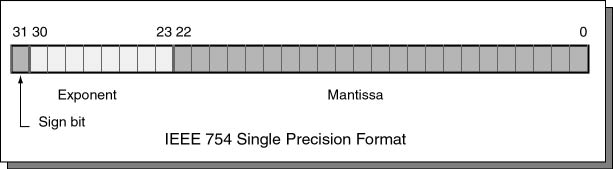
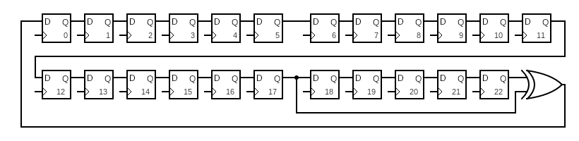
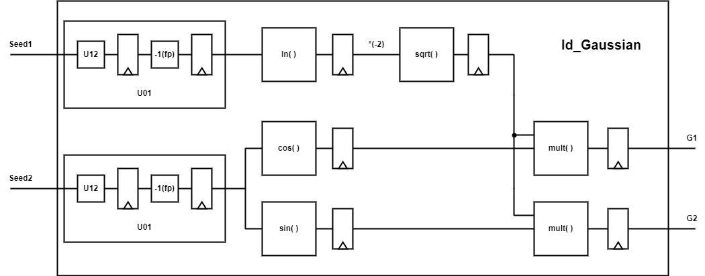
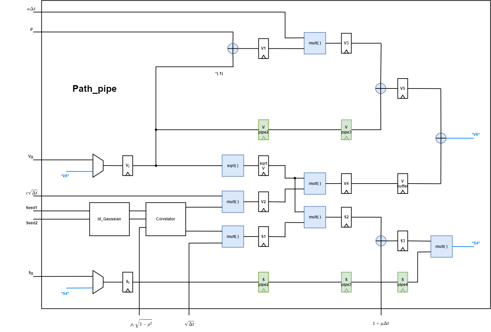
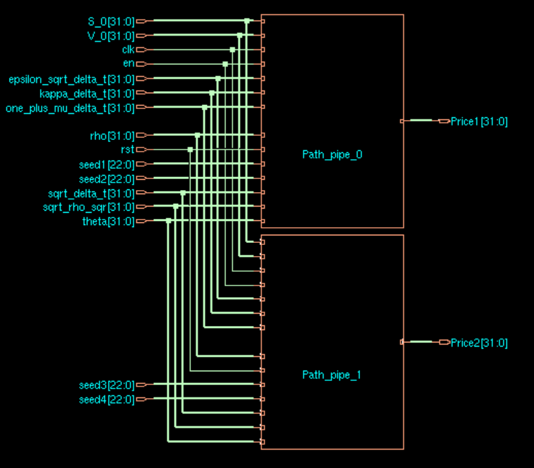

# Heston-Model-Hardware-Acceleration

## Description
This is a project for undergraduate research program at National Taiwan University, advised by Prof. Yi-Chang Lu.  
This work implements a hardware accelerator for option pricing using Heston model and Monte Carlo simulation.  
  
The Heston model, named after Steven L. Heston, is a mathematical model that use random process to describe the evolution of the volatility of an underlying asset. 
<p align="center">
  
</p>
Note that in the above equations, the two W variables are Wiener processes (i.e., continuous random walks) with arbitrary correlation.  
For more information about the model, please refer to "A Closed-Form Solution for Options with Stochastic Volatility with Applications to Bond and Currency Options", by Steven L. Heston.  
<br />
<br />
Monte Carlo simulation is a method that rely on repeated independent random sampling to obtain numerical results. Generally, it is preferable to use MC simulation for random process equations due to the long latency to obtain an exact solution.  
<br />
<br />
Below is a simple demo of Heston model Monte Carlo simulation for a asset that starts with a price of 100.  
After going through 10000 different random process/path samples that end at day 365, we can collect the 10000 different results and compute the appropriate 1 year option price for this asset. 
<p align="center">
  
</p>

## Hardware Design
The Gaussian random samples are generated with LFSR, Box-Muller transformation and coloring transform.
<br />
With IEEE 754 single precision format
<p align="center">
  
</p>
setting the Sign bit field to 0, the Exponent field to 01111111, and using a 23 bits LFSR as the Mantissa field can represent a Uniform(1, 2) distribution.
<p align="center">
  
</p>
Offsetting the Uniform(1, 2) distribution with -1, we can obtain an Uniform(0, 1) distribution.
<br />
Box-Muller transformation is implemented with various Design Ware's floating point arithmetics. The result G1 and G2 are Gaussian samples independent to each other.
<br />
<br />
<p align="center">
  
</p>
The Correlator module generates the correlated bivariate Gaussian samples with coloring transform.
<br />
<br />
<p align="center">
  
</p>
With the bivariate Gaussian random number generator, we can implement the pipelined core computing the simulation path of <i>S</i><sub>i</sub> and <i>V</i><sub>i</sub> with Monte Carlo method.
<br />
<br />
<p align="center">
  
</p>
Note that since the RNG can provide a sample every clock cycle, the additional green pipeline registers and some control logic design make the hardware utilization rate of the floating point arithmetic units optimal.
<br />
Without those registers, we need four times the floating point arithmetic units to keep up with/fully utilize our RNG and pipeline design.

## Simulation
To test the quality of the U(0, 1) RNG, run the testbench to get the random samples written into U01.txt.  
```
$ ncverilog U01_tb.v U12.v U01.v -y /usr/cad/synopsys/synthesis/cur/dw/sim_ver/ +libext+.v +notimingchecks +access+r
```
Note the -y path is to specify the directory of required designware module.  
Then use the code written in the ipython notebook to see the mean, variance of the distribution and a comparison to ideal U(0, 1).
<p align="center">
  
  
</p>

To test the quality of the Gaussian RNG, first copy the required file for designware module.  
```
$ cp /usr/cad/synopsys/synthesis/cur/dw/sim_ver/DW_sqrt_function.inc DW_sqrt_function.inc
```
Then run the testbench to get the random samples written into GRNG1.txt.  
```
$ ncverilog Id_Gaussian_tb.v U12.v U01.v Id_Gaussian.v -y /usr/cad/synopsys/synthesis/cur/dw/sim_ver/ +libext+.v +notimingchecks +access+r
```
Manually modify the Id_Gaussian_tb.v and run the above command again to get GRNG2.txt.  
Use the code written in the ipython notebook to see the mean, variance, correlation, and a display of the distribution.
<p align="center">
  
</p>

To test the quality of the correlation module, run and modify the Correlator_tb.v to get the random samples written into Corr1.txt and Corr2.txt.  
```
$ ncverilog Correlator_tb.v U12.v U01.v Id_Gaussian.v Correlator.v -y /usr/cad/synopsys/synthesis/cur/dw/sim_ver/ +libext+.v +notimingchecks +access+r
``` 
Then use the code written in the ipython notebook to see the mean, variance, correlation, and a display of the distribution.
<p align="center">
  
</p>

## Schematic View
<p align="center">
  
</p>

## Layout
clock tree
<p align="center">
  
</p>
chip
<p align="center">
  
</p>
area
<p align="center">
  
</p>

## Author
Contributors names and contact info

Hao-Wei, Liang (b07502022@ntu.edu.tw)

If you have any question, please contact me with the email address above.
